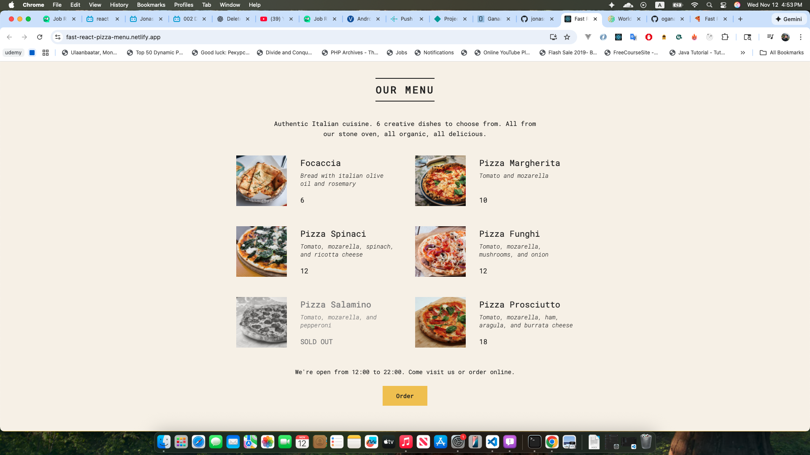

# Fast React Pizza 🍕

A modern pizza ordering application built with **React**, featuring **React Router data loading**, **Redux Toolkit** for global state management, **Thunks** for asynchronous logic, and **Tailwind CSS** for sleek, responsive styling.

🔗 **Live Demo:** [Fast React Pizza](https://fast-pizza-mng.netlify.app/)  
📂 **GitHub Repository:** [fast-react-pizza](https://github.com/oganaa2472/fast-react-pizza/)

---

## 🚀 Features

- 🍕 Browse a dynamic menu of pizzas
- 🛒 Add/remove items from your cart
- 💰 Real-time order total and checkout
- ⏱️ Track order status with asynchronous updates
- 🔄 Data loading via **React Router v6.4+ loaders**
- ⚙️ Global state managed with **Redux Toolkit** and **Thunks**
- 💅 Fully styled with **Tailwind CSS**

---
## 🖼️ Preview

## 🧰 Technologies Used

- **React** (Functional Components + Hooks)
- **React Router v6.4+** (Data loading, loaders, and actions)
- **Redux Toolkit** (Slices, Store)
- **Redux Thunk** (Async logic)
- **Tailwind CSS**
